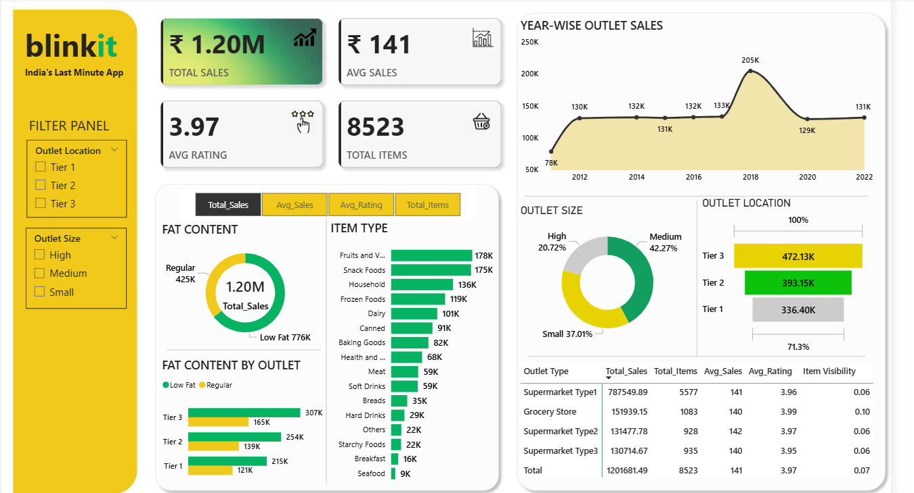

# 🛒 Blinkit Store Analysis Dashboard

> **End-to-end sales and outlet performance analysis for Blinkit — India's Last Minute App — built using Python (EDA) and Power BI (interactive dashboard).**

---

## 📌 Overview

This project analyzes Blinkit's retail outlet data to uncover sales trends, product category performance, and outlet-level metrics. The analysis spans across 8,500+ items and multiple outlet types, sizes, and geographic tiers. It combines exploratory data analysis (EDA) in Python with a fully interactive Power BI dashboard to deliver actionable business intelligence.

---

## ❓ Problem Statement

Blinkit operates a diverse network of grocery stores and supermarkets across Tier 1, Tier 2, and Tier 3 cities. The business needed clarity on:

- Which outlet types, sizes, and locations drive the most revenue?
- How does fat content (product health profile) affect sales?
- Which item categories contribute most to overall sales?
- How have outlet establishments grown over time, and what does that mean for future strategy?

---

## 📂 Dataset

| Attribute | Details |
|---|---|
| **Total Records** | 8,523 items |
| **Key Fields** | Item Type, Item Fat Content, Item Identifier, Item Visiblity, Outlet Identifier, Outlet Type, Outlet Size, Outlet Location (Tier), Outlet Establishment Year, Sales, Rating |

---

## 🛠️ Tools & Technologies

| Tool | Purpose |
|---|---|
| **Python** | Exploratory Data Analysis (EDA) |
| **Pandas** | Data cleaning and transformation |
| **Matplotlib** | Data visualization in notebooks |
| **Jupyter Notebook** | Interactive EDA environment |
| **Power BI Desktop** | Interactive business intelligence dashboard |

---

## 🔬 Methods
1. **Data Ingestion** — Loaded `Blinkit Grocery Data.csv` into a Pandas DataFrame and performed an initial inspection using `df.head()` to understand structure, column types, and data shape.
2. **Data Cleaning** — Identified and corrected inconsistent label variants in the `Item Fat Content` column — using `df.replace()`. Post-cleaning uniqueness was verified to confirm data integrity.
3. **Exploratory Data Analysis (EDA)** — Analyzed sales by item type, fat content, outlet size, outlet location tier, and establishment year using Pandas groupby operations and visualizations (bar charts, pie charts, line charts) in Jupyter Notebook.
4. **Dashboard Development** — Built a multi-visual Power BI report with slicers for Outlet Location and Outlet Size, enabling dynamic filtering.

---

## 💡 Key Insights

- **Total Sales of ₹1.20M** were generated across all outlets, with an average sale value of ₹141 per item and an average customer rating of 3.97/5.
- **Supermarket Type1** is the dominant outlet type, contributing ~₹787K (65.5% of total sales) across 5,577 items.
- **Tier 3 cities lead in sales (₹472K)**, outperforming Tier 2 (₹393K) and Tier 1 (₹336K), indicating strong demand in smaller cities.
- **Medium-sized outlets** are the most common (42.27%) and contribute the largest share of revenue.
- **Fruits & Vegetables and Snack Foods** are the top-performing item categories ,followed by Household items.
- **Low Fat products (₹776K)** outsell Regular fat products (₹425K), reflecting a health-conscious consumer trend.
- **Outlet growth climbed steadily from 78K in 2012 to a peak of 205K in 2018** and has since stabilized around ₹130–133K annually, suggesting market maturity.
- **Medium-sized outlets** dominate (42.27% of outlets), followed by Small (37.01%) and High (20.72%).

---

## 📸 Dashboard Screenshot

---

## 📈 Results & Conclusion

The analysis reveals that **Blinkit's revenue is disproportionately driven by Supermarket Type1 outlets in Tier 3 cities**, presenting a clear opportunity to scale this model in these cities. The popularity of Low Fat products signals a shift toward health-conscious purchasing that Blinkit can leverage through targeted product assortment. With outlet growth stabilizing post-2018, the focus should now shift from expansion to **optimization of existing outlets** — improving item visibility, ratings, and category depth — especially in Grocery Stores which already show the best customer ratings. Overall, the dashboard provides Blinkit's business teams with a reliable, filterable view of performance to support data-driven decisions.

---

## 🙋 Author

**Apurva Pandita**  
[LinkedIn](https://www.linkedin.com/in/apurva-pandita-b51812272/) · [GitHub](https://github.com/ApurvaPandita) · apandita04@gmail.com

